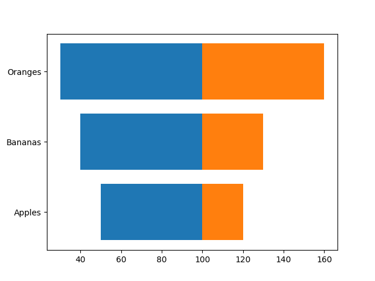

# tornadopy

Create tornado charts with Python.

## Getting started

1. Clone repository: `git clone https://github.com/janwillembuist/tornadopy`
2. Install: `python setup.py install`


## Example usage

Using tornadopy should not be too difficult. For example, the following code snippit will generate the image below.

```
import tornadopy
import matplotlib.pyplot as plt

a = [50, 40, 30]
b = [120, 130, 160]
c = 100

plt.figure()
tornadopy.plot(a, b, center=c)
tornadopy.set_labels(['Apples', 'Bananas', 'Oranges'])
plt.savefig('example.png')
plt.show()
```

